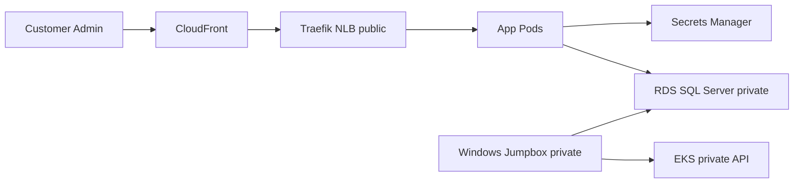
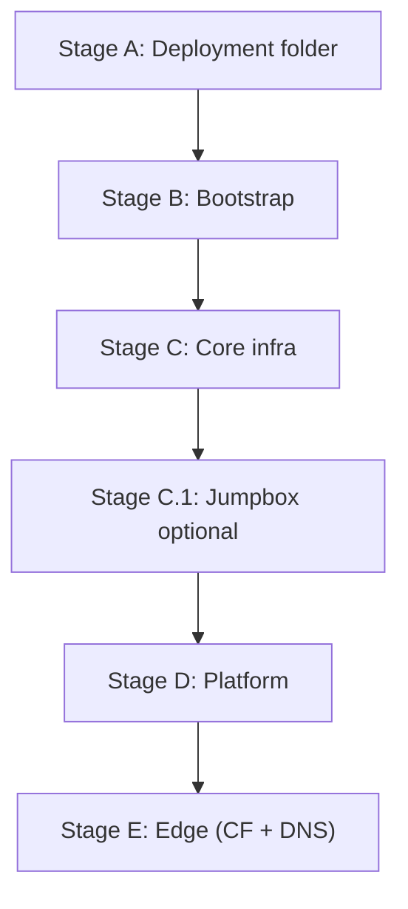

# Overview

This repo provides a **customer‑run installer** for deploying the product into a
customer‑owned AWS account using OpenTofu (infra) and Helm/manifests (platform).
It is safe‑by‑default: no secrets in Git, no vendor‑owned pipelines required.

## Core principles

- **Customer‑owned execution**: run locally or in customer CI.
- **No secrets in state or Git**: license and origin secrets live in Secrets Manager.
- **Staged deployment**: core infra → platform → edge (CloudFront/DNS).
- **Private by default**: EKS API and RDS are private; ingress is via CloudFront → public NLB.

## What gets deployed

- **Bootstrap**: S3 state bucket, DynamoDB lock table, KMS key.
- **Core infra**: VPC, EKS (Linux + Windows), RDS SQL Server, ACM cert (us‑east‑1).
- **Edge**: CloudFront distribution + Route53 alias.
- **Optional**: Windows jumpbox for GUI management (SSM/RDP).

## Architecture (high level)

## Deployment stages

## Staged flow (recommended)

1. **Stage A** – Create deployment folder  
2. **Stage B** – Bootstrap state backend  
3. **Stage C** – Core infra (VPC + EKS + RDS + ACM)  
4. **Stage C.1** – Jumpbox (optional)  
5. **Stage D** – Platform (Traefik/NLB + app)  
6. **Stage E** – Edge (CloudFront + Route53)

## Key design choices

- **CloudFront** is the only public edge. Origin is the NLB created by Traefik.
- **ACM must be in us‑east‑1** for CloudFront.
- **EKS API is private by default**; use a jumpbox or VPN/Direct Connect for kubectl/Helm.
- **Secrets** are stored in AWS Secrets Manager and mounted into pods.

## Where to start

- Prereqs: `docs/01-prereqs.md`
- Local quickstart: `docs/02-quickstart-local.md`
- IAM role plan: `docs/iam-deploy-role.md`
